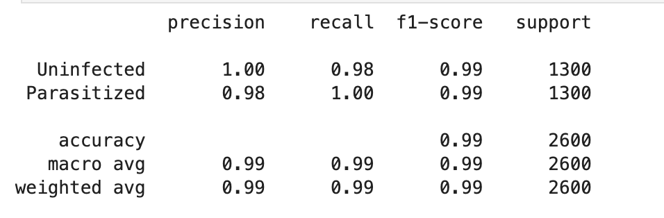
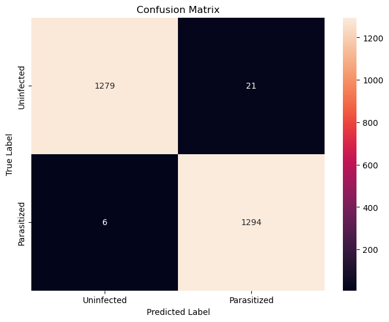
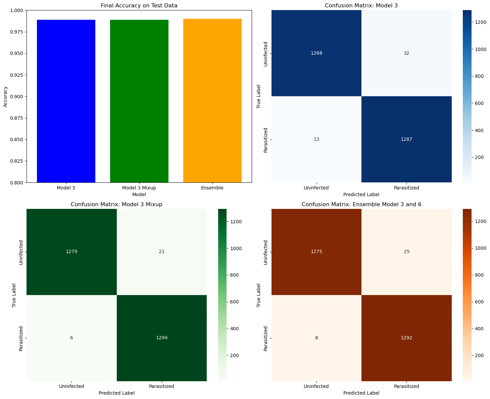

# Malaria Detection Using Deep Learning Models

## Project Overview
This project focuses on detecting malaria from microscopic blood smear images using deep learning models. The goal is to classify blood cells as either **Parasitized** or **Uninfected** with high accuracy, enabling early diagnosis and treatment.

Key steps in the project include:
- Data preprocessing and augmentation.
- Implementation of CNN-based deep learning models.
- Evaluation of models using precision, recall, and F1-score metrics.
- Use of Mixup augmentation and ensemble models for performance improvement.

---

## Results
### Classification Metrics
The model achieved the following results on the test dataset:
- **Accuracy**: 99%
- **Precision (Parasitized)**: 98%
- **Recall (Parasitized)**: 100%



### Confusion Matrix


### Comparison of Final Models


---

## How to Reproduce This Project
1. Clone this repository:
   ```bash
   git clone https://github.com/your-username/professional-data-science-portfolio.git
   cd professional-data-science-portfolio/malaria-detection